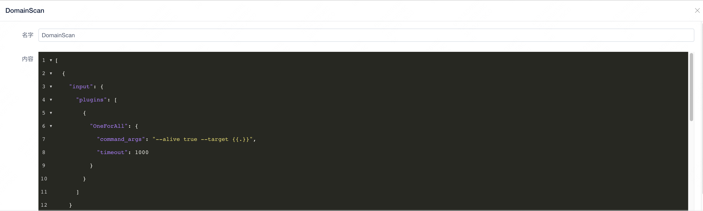

# PokemonScan

**_A Distributed Scan Scheduling Center_**

You can chain any of your tools here , build your own pokeball , build your own workflow .
no longer need to focus on the input and output of the tool, only the effect of the tool itself .

[中文文档](https://pokemonscan.github.io)

## quick start 

### INSTALL

#### Server 

download `server.zip`

```bash
unzip server.zip
```

Three files will be extracted
- docker-compose.yml
- install.sh
- openssl.cnf

Execute the installation script

```bash
bash install.sh
```

Observe the output of the installation script, and finally the log will be output
```
success init admin user : password xxxxxxxxxx
```

At this time, a new default account admin is created, and the password is as above. If you forget the password, read the secret field of daycare_config.yml in the config directory

Visit http://ip:2314 If it can be accessed normally, the installation is successful

#### Worker

Click the `install worker` button, copy the installation command, and execute it on the worker

```bash
curl http://ip:2314/pokemon/go?token=xxxxxx | bash
```

### Start Scan

#### config your workspace


#### config your workflow temple

For specific configuration, please refer to the   [document](https://pokemonscan.github.io/#/zh-cn/%E9%85%8D%E7%BD%AE%E8%AF%B4%E6%98%8E/workflow_config)

Here is a minimal example

```json
[
  {
    "input": {
      "plugins": [
        {
          "OneForAll": {
            "command_args": "--alive true --target {{.}}",
            "timeout": 1000
          }
        }
      ]
    }
  },
  {
    "website": {
      "plugins": [
        {
          "Rad": {
            "target": "{{.Url}}",
            "downstream_plugin": "Recorder"
          }
        },
        {
          "Nuclei": {
            "target": "{{.Url}}"
          }
        }
      ],
      "workflow_space": "workflow"
    }
  }
]
```



#### config your workflow 

Configure the input he needs for the workflow

For example, the above workflow template needs to input a domain name


start it , then wait for the result

## DEV

[add plugin document](https://pokemonscan.github.io/#/zh-cn/%E5%BC%80%E5%8F%91%E6%96%87%E6%A1%A3/plugin)

Currently supported plugins
 
- [Xray](https://github.com/chaitin/xray)
- [OneForAll](https://github.com/shmilylty/OneForAll.git) 
- [ENScan](https://github.com/wgpsec/ENScan_GO)
- [Fofa](https://fofa.info/)
- Recorder

You are welcome to contribute code to PokemonScan

## problem

If you have any ideas, suggestions or bugs, please submit an issue to me.

Follow my WeChat public account to get the latest version update


